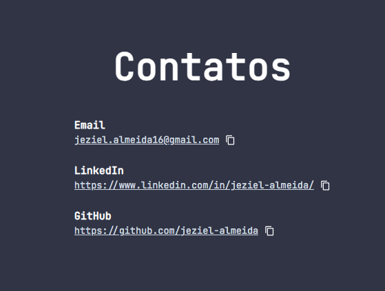

## Portfolio feito com Next.js, TypeScript e TailwindCSS

Site: https://jeziel-portfolio.vercel.app/




## Tests:

> npm install --save-dev jest jest-environment-jsdom @testing-library/react @testing-library/jest-dom -D

> npm install @types/jest -D

> [Optional] npm install @types/testing-library__jest-dom -D

Configurar package.json:

```json
{
  "scripts": {
      ...
      "test": "jest",
      "watch": "jest --watch",
      "updateSnapshot": "jest --updateSnapshot",
      "coverage": "jest --coverage"
}
```
